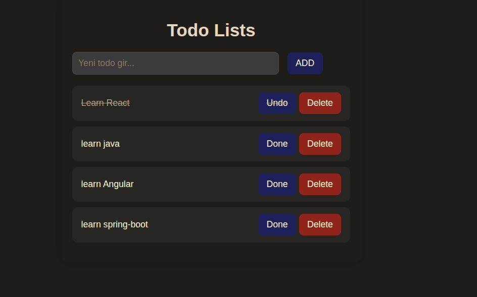

# React Todo App

A simple Todo application built with React and powered by `json-server` for mock API functionality.

## 🚀 Features

- Add new todos
- Mark todos as completed / uncompleted
- Delete todos
- Clean and responsive UI
- JSON server used as fake backend

## 🧱 Technologies

- React (with Hooks)
- CSS (custom styles)
- JSON Server

## 📦 Installation

1. **Clone the repository**

git clone https://github.com/bllexe/react-todo-app.git

## 🧱 Run the server 

 npx json-server --watch db.json --port 3001

 ## 🖥️ Screenshot

 
